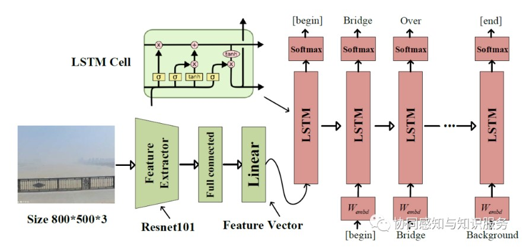
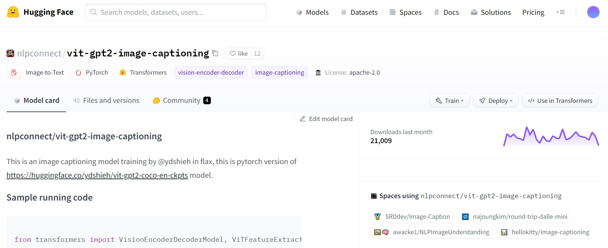
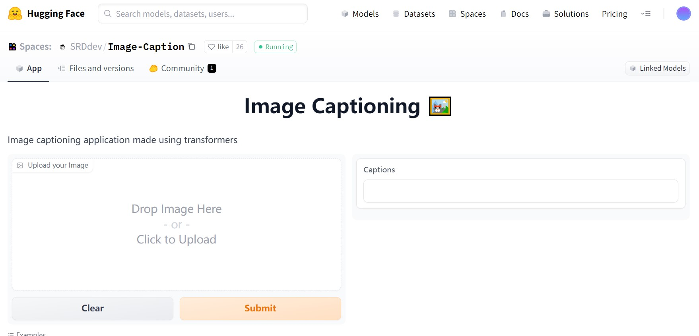

# CityCaption
### Please Cite Our Paper:
@article{ZHANG2022102989,
title = {Migratable urban street scene sensing method based on vision language pre-trained model},
journal = {International Journal of Applied Earth Observation and Geoinformation},
volume = {113},
pages = {102989},
year = {2022},
issn = {1569-8432},
doi = {https://doi.org/10.1016/j.jag.2022.102989},
url = {https://www.sciencedirect.com/science/article/pii/S1569843222001807},
author = {Yan Zhang and Fan Zhang and Nengcheng Chen},
keywords = {GeoAI, Natural language processing, Data translation, Pretrained model, Street view, Multi-modal},
abstract = {We propose a geographically reproducible approach to urban scene sensing based on large-scale pre-trained models. With the rise of GeoAI research, many high-quality urban observation datasets and deep learning models have emerged. However, geospatial heterogeneity makes these resources challenging to share and migrate to new application scenarios. This paper introduces vision language and semantic pre-trained model for street view image analysis as an example. This bridges the boundaries of data formats under location coupling, allowing for the acquisition of text-image urban scene objective descriptions in the physical space from the human perspective, including entities, entity attributes, and the relationships between entities. Besides, we proposed the SFT-BERT model to extract text feature sets of 10 urban land use categories from 8,923 scenes in Wuhan. The results show that our method outperforms seven baseline models, including computer vision, and improves 15% compared to traditional deep learning methods, demonstrating the potential of a pre-train & fine-tune paradigm for GIS spatial analysis. Our model could also be reused in other cities, and more accurate image descriptions and scene judgments could be obtained by inputting street view images from different angles. The code is shared at: github.com/yemanzhongting/CityCaption.}
}

Using NLP For City Learning
### Step1:get sv image caption
### Step2:using pretrained semantic model to deal with caption word
### Step3:predict in other cities

### 关键讲述从图片到文本的跨模态步骤

jupyter notebook:https://github.com/yemanzhongting/CityCaption/blob/master/jupyter%20code/Captioning_street_view.ipynb

**Step1,**我们需要安装vqa-maskrcnn-benchmark的库

它可以提供基于pytorch的Faster R-CNN and Mask R-CNN算法


对其进行编译

```
!python setup.py build
!python setup.py develop
```


```
# Install maskrcnn-benchmark to extract detectron features
%cd /content
!git clone https://gitlab.com/vedanuj/vqa-maskrcnn-benchmark.git
%cd /content/vqa-maskrcnn-benchmark
# Compile custom layers and build mask-rcnn backbone
!python setup.py build
!python setup.py develop
import sys
sys.path.append('/content/vqa-maskrcnn-benchmark')
```

**Step2:**使用跨模态预训练模型

Annotation of multimodal data is extremely expensive, and the most prominent open source image caption datasets are as follows:

1. Microsoft COCO dataset (It is the most commonly used training resource for multi-modality, including indoor and outdoor environments, with over 1.5 million captions describing over 330,000 images).

2. Flickr30k dataset  (It contains 31,000 images collected from Flickr platform, and 5 reference sentences provided by human volunteer, which are mainly from social media).

3. Google Conceptual Captions dataset (3 million images, paired with natural-language captions, mainly from Internet HTML pages).

The Microsoft Common Objects in Context dataset is the most widely applicable and is the one we use. This dataset consists of indoor and outdoor scene, 80 object classes, and 5 manually annotated descriptions for each image. Microsoft company invites volunteers to provide textual descriptions of every images and to cross-validate them.

**image caption 架构**



For the decoder part, the most common one is the Long short-term memory (LSTM) recurrent neural network; for the encoder part (green), there are **three main methods**: Resnet101 feature, Bottom-Up feature, and the vilbert feature (**accuracy** CIDEr=1.158,SPICE=0.2114).

The main difference between the three encoding methods is that Resnet101 is a 101-layer-deep convolutional neural network trained on more than one million images that could identify 1,000 object classes. 

Bottom-Up method uses Faster R-CNN to extract image features, dividing the image into $k$ regions. 

Vilbert feature extracting method is a joint representation model for images and natural language. 

**加载预训练文件**

```
# Download the models for feature extraction
%cd /content/

%mkdir model_data
# !wget -O /content/model_data/detectron_model.pth  https://dl.fbaipublicfiles.com/pythia/detectron_model/detectron_model.pth 
# !wget -O /content/model_data/detectron_model.yaml https://dl.fbaipublicfiles.com/pythia/detectron_model/detectron_model.yaml

!wget -O /content/model_data/detectron_model.pth wget https://dl.fbaipublicfiles.com/vilbert-multi-task/detectron_model.pth
!wget -O /content/model_data/detectron_model.yaml wget https://dl.fbaipublicfiles.com/vilbert-multi-task/detectron_config.yaml
```

**Step3**:实现图像文本的解译

使用到了opencv与yaml请自行安装

```
import yaml
import cv2
import torch
import requests
import numpy as np
import gc
import torch.nn.functional as F
import pandas as pd


import torchvision.models as models
import torchvision.transforms as transforms

from PIL import Image
from IPython.display import display, HTML, clear_output
from ipywidgets import widgets, Layout
from io import BytesIO


from maskrcnn_benchmark.config import cfg
from maskrcnn_benchmark.layers import nms
from maskrcnn_benchmark.modeling.detector import build_detection_model
from maskrcnn_benchmark.structures.image_list import to_image_list
torch._six.PY3 = True  # fix for newer pytorch
from maskrcnn_benchmark.utils.model_serialization import load_state_dict


class FeatureExtractor:
  TARGET_IMAGE_SIZE = [448, 448]
  CHANNEL_MEAN = [0.485, 0.456, 0.406]
  CHANNEL_STD = [0.229, 0.224, 0.225]
  
  def __init__(self):
    # self._init_processors()
    self.detection_model = self._build_detection_model()
  
  def __call__(self, url):
    with torch.no_grad():
      detectron_features = self.get_detectron_features(url)
    
    return detectron_features
  
  def _build_detection_model(self):

      cfg.merge_from_file('/content/model_data/detectron_model.yaml')
      cfg.freeze()

      model = build_detection_model(cfg)
      checkpoint = torch.load('/content/model_data/detectron_model.pth', 
                              map_location=torch.device("cpu"))

      load_state_dict(model, checkpoint.pop("model"))

      model.to("cuda")
      model.eval()
      return model
  
  def get_actual_image(self, image_path):
      if image_path.startswith('http'):
          path = requests.get(image_path, stream=True).raw
      else:
          path = image_path
      
      return path

  def _image_transform(self, image_path):
      path = self.get_actual_image(image_path)

      img = Image.open(path)
      im = np.array(img).astype(np.float32)
      im = im[:, :, ::-1]
      im -= np.array([102.9801, 115.9465, 122.7717])
      im_shape = im.shape
      im_size_min = np.min(im_shape[0:2])
      im_size_max = np.max(im_shape[0:2])
      im_scale = float(800) / float(im_size_min)
      # Prevent the biggest axis from being more than max_size
      if np.round(im_scale * im_size_max) > 1333:
           im_scale = float(1333) / float(im_size_max)
      im = cv2.resize(
           im,
           None,
           None,
           fx=im_scale,
           fy=im_scale,
           interpolation=cv2.INTER_LINEAR
       )
      img = torch.from_numpy(im).permute(2, 0, 1)
      return img, im_scale


  def _process_feature_extraction(self, output,
                                 im_scales,
                                 feat_name='fc6',
                                 conf_thresh=0.2):
      batch_size = len(output[0]["proposals"])
      n_boxes_per_image = [len(_) for _ in output[0]["proposals"]]
      score_list = output[0]["scores"].split(n_boxes_per_image)
      score_list = [torch.nn.functional.softmax(x, -1) for x in score_list]
      feats = output[0][feat_name].split(n_boxes_per_image)
      cur_device = score_list[0].device

      feat_list = []

      for i in range(batch_size):
          dets = output[0]["proposals"][i].bbox / im_scales[i]
          scores = score_list[i]

          max_conf = torch.zeros((scores.shape[0])).to(cur_device)

          for cls_ind in range(1, scores.shape[1]):
              cls_scores = scores[:, cls_ind]
              keep = nms(dets, cls_scores, 0.5)
              max_conf[keep] = torch.where(cls_scores[keep] > max_conf[keep],
                                           cls_scores[keep],
                                           max_conf[keep])

          keep_boxes = torch.argsort(max_conf, descending=True)[:100]
          feat_list.append(feats[i][keep_boxes])
      return feat_list
    
  def get_detectron_features(self, image_path):
      im, im_scale = self._image_transform(image_path)
      img_tensor, im_scales = [im], [im_scale]
      current_img_list = to_image_list(img_tensor, size_divisible=32)
      current_img_list = current_img_list.to('cuda')
      with torch.no_grad():
          output = self.detection_model(current_img_list)
      feat_list = self._process_feature_extraction(output, im_scales, 
                                                  'fc6', 0.2)
      return feat_list[0]
```

提取特征

```
feature_extractor = FeatureExtractor()
```

加载词表

```
import captioning
import captioning.utils.misc
import captioning.models
infos = captioning.utils.misc.pickle_load(open('infos_trans12-best.pkl', 'rb'))
```

```
infos['opt'].vocab = infos['vocab']
```

使用cuda加速

```
model = captioning.models.setup(infos['opt'])
model.cuda()
model.load_state_dict(torch.load('model-best.pth'))
```

```
def get_captions(img_feature):
    # Return the 5 captions from beam serach with beam size 5
    return model.decode_sequence(model(img_feature.mean(0)[None], img_feature[None], mode='sample', opt={'beam_size':5, 'sample_method':'beam_search', 'sample_n':5})[0])
```

```
def init_widgets(url):
  image_text = widgets.Text(
    description="Image URL", layout=Layout(minwidth="70%")
  )

  image_text.value = url
  submit_button = widgets.Button(description="Caption the image!")

  display(image_text)
  display(submit_button)

  submit_button.on_click(lambda b: on_button_click(
      b, image_text
  ))
  
  return image_text
  
def on_button_click(b, image_text):
  clear_output()
  image_path = feature_extractor.get_actual_image(image_text.value)
  image = Image.open(image_path)
  
  captions = '<br>'.join(get_captions(feature_extractor(image_text.value)))
  init_widgets(image_text.value)
  display(image)
  
  display(HTML(captions))
 

image_text = init_widgets(
    #"http://images.cocodataset.org/train2017/000000505539.jpg"
   "http://www.qiaoyou020.com/UserData/6079/images/6359310019134952985647405.jpg"
)
```

<!--  -->


迭代计算自己的图像库

```
import os
def get_streetviewcaption(photo_dirs,nid):
    photo_path=os.path.join(photo_dirs,nid)
    ###
    image_text.value = photo_path
    image_path = feature_extractor.get_actual_image(image_text.value)
    image = Image.open(image_path)
    caption=';'.join(get_captions(feature_extractor(image_text.value)))
    ###
    return caption
```

我们提供了以上步骤所需要的文件:

链接：https://pan.baidu.com/s/1SKO7_tilGI5eHjm55_nZDw?pwd=mupa 
提取码：mupa 

Ref:

https://github.com/Cadene/vqa-maskrcnn-benchmark

https://github.com/ruotianluo/ImageCaptioning.pytorch


此外,如果只需要做测试,简易方法是使用hugging face的预训练模型. 他的训练逻辑与上述有所不同,以VIT transformer作为图像端的特征抽取,以GPT2作为文本生成部分.



hugging face是一个基于transformer的开源社区,作者已经共享了模型vit-gpt2-image-captioning,在**Google Colab平台**下使用更佳.

```python

from transformers import VisionEncoderDecoderModel, ViTFeatureExtractor, AutoTokenizer

model = VisionEncoderDecoderModel.from_pretrained("nlpconnect/vit-gpt2-image-captioning")
feature_extractor = ViTFeatureExtractor.from_pretrained("nlpconnect/vit-gpt2-image-captioning")
tokenizer = AutoTokenizer.from_pretrained("nlpconnect/vit-gpt2-image-captioning")

device = torch.device("cuda" if torch.cuda.is_available() else "cpu")
model.to(device)

max_length = 16
num_beams = 4
gen_kwargs = {"max_length": max_length, "num_beams": num_beams}
def predict_step(image_paths):
  images = []
  for image_path in image_paths:
    i_image = Image.open(image_path)
    if i_image.mode != "RGB":
      i_image = i_image.convert(mode="RGB")

    images.append(i_image)

  pixel_values = feature_extractor(images=images, return_tensors="pt").pixel_values
  pixel_values = pixel_values.to(device)

  output_ids = model.generate(pixel_values, **gen_kwargs)

  preds = tokenizer.batch_decode(output_ids, skip_special_tokens=True)
  preds = [pred.strip() for pred in preds]
  return preds


predict_step(['doctor.e16ba4e4.jpg'] # ['a woman in a hospital bed with a woman in a hospital bed']
```

或者更简单的,您可以在web上进行简单测试(不保证精度):

https://huggingface.co/spaces/SRDdev/Image-Caption



